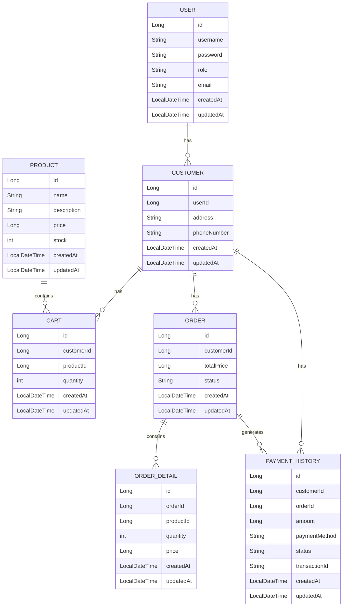

쇼핑몰 기본 백엔드 api 구현

## 기술 스택
- Java 21
- Spring Boot 3.4.3
- MariaDB 10.6.21
- Spring Data JPA (Java Persistence API)
- Git

#ERD

# API 엔드포인트

## 특정 사용자 조회
GET /users/{id}

## 사용자 추가
POST /users

## 사용자 수정
PUT /users/{id}

## 사용자 삭제
DELETE /users/{id}

## 고객 조회
GET /customers/{userId}

## 고객 수정
PUT /customers/{userId}

## 모든 상품 조회
GET /products

## 상품 조회
GET /products/{id}

## 재고 상품 조회
GET /products/in-stock

## 상품 추가
POST /products

## 상품 수정
PUT /products/{id}

## 상품 삭제
DELETE /products/{id}

## 장바구니 아이템 조회
GET /cart/{customerId}

## 장바구니 아이템 추가
POST /cart

## 장바구니 아이템 수정
PUT /cart/{id}

## 장바구니 아이템 삭제
DELETE /cart/{id}

## 주문 내역 조회
GET /orders/{customerId}

## 주문 생성 및 결제
POST /orders

## 장바구니 -> 주문 및 결제
POST /orders/{customerId}/cart-to-order

## 결제 이력 조회
GET /payment-history/{customerId}

## 모든 결제 이력 조회
GET /payment-history
