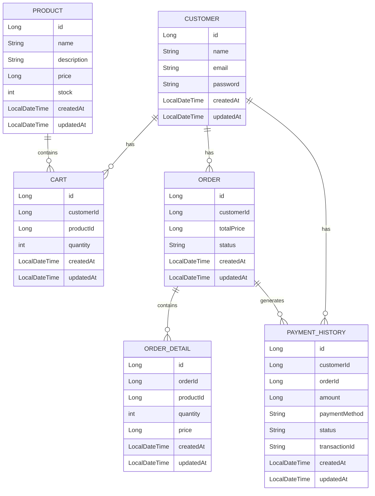

##지원자 : 허담

# allra 백엔드 과제

## 기능
- **상품 조회**: 구매 가능한 상품 목록을 불러옵니다.
- **장바구니**: 상품을 장바구니에 추가하고 수량을 관리합니다.
- **주문 및 결제**: 주문을 제출하고 결제를 처리합니다.
- **주문 내역 조회**: 사용자의 완료된 주문 기록을 조회합니다.

## 기술 스택
- Java 21
- Spring Boot 3.4.3
- MariaDB 10.6.21
- JPA (Java Persistence API)
- Git

#ERD

##API 엔드포인트

## 특정 고객 조회
GET /customers/{id}

## 새로운 고객 추가
POST /customers

## 기존 고객 수정
PUT /customers/{id}

## 고객 삭제
DELETE /customers/{id}

## 모든 상품 조회
GET /products

## 특정 상품 조회
GET /products/{id}

## 재고 수량이 0보다 큰 상품 조회
GET /products/in-stock

## 새로운 상품 추가
POST /products

## 기존 상품 수정
PUT /products/{id}

## 상품 삭제
DELETE /products/{id}

## 특정 고객의 장바구니 아이템 조회
GET /cart/{customerId}

## 장바구니에 아이템 추가
POST /cart

## 장바구니 아이템 수정
PUT /cart/{id}

## 장바구니 아이템 삭제
DELETE /cart/{id}

## 특정 고객의 주문 내역 조회
GET /orders/{customerId}

## 주문 생성 및 결제 처리
POST /orders

## 장바구니의 모든 상품을 주문으로 변환하고 결제 처리
POST /orders/{customerId}/cart-to-order

## 특정 고객의 결제 이력 조회
GET /payment-history/{customerId}

## 모든 결제 이력 조회
GET /payment-history
